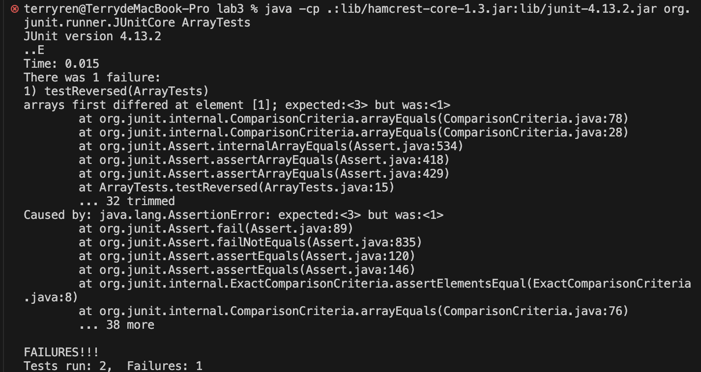
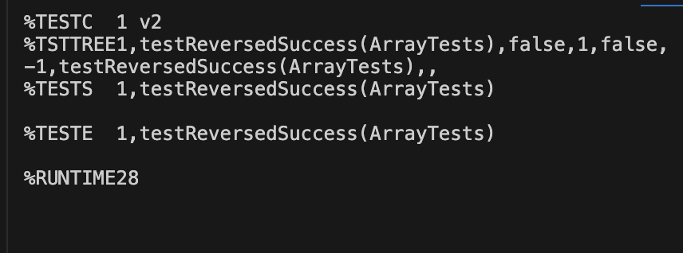

# CSE15l-labReport3-Terry
## Part 1 Bugs
### Buggy Program:
The buggy program I chose is the `reversed` method is thr `ArrayExample.java` <br>
#### Failure-inducing input
```java 
@Test
  public void testReversed() {
    int[] input1 = {1, 2, 3, 4, 5, 6};
    assertArrayEquals(new int[]{6, 5, 4, 3, 2, 1}, ArrayExamples.reversed(input1));
  }
 
```
#### Input does not induce a failure
```java
 @Test 
  public void testReversedSuccess() {
      int[] input1 = {1, 2, 3};
      assertArrayEquals(new int[]{3, 2, 1}, ArrayExamples.reversed(input1)); // This will pass
  }
```

#### The symptom



#### Before-and-after code
##### Before:
```java
  static int[] reversed(int[] arr) {
    int[] newArray = new int[arr.length];
    for(int i = 0; i < arr.length/2; i ++) {
      int left = arr[i];
      int right = arr[arr.length - 1];
      arr[i] = right;
      arr[arr.length - i - 1] = left;
    }
    return arr;
  }
```
##### After:
```java
  static int[] reversed(int[] arr) {
    int[] newArray = new int[arr.length];
    for(int i = 0; i < arr.length/2; i ++) {
      int left = arr[i];
      int right = arr[arr.length - i - 1];
      arr[i] = right;
      arr[arr.length - i - 1] = left;
    }
    return arr;
  }
```
#### Why the fix addresses the issue
The bug was that the original implementation didn't update the value of `int right`. Hence made the value stay unchanged for every iteration. The reason why it passed the 3 - elements testcase is that the value of `int right` didn't need to go through the second iteration. The fixed code ensure that that the pointer `right` can be updated and move to left in every iteration.

## Part 2 - Researching Commands
### The command I chose -  `grep`
#### Example 1 - `grep -c`
```console
terryren@TerrydeMacBook-Pro plos % grep -c "Kofi Annan" journal.pbio.0020001.txt 
1
```
```console 
terryren@TerrydeMacBook-Pro plos % grep -c "Annan" journal.pbio.0020001.txt
7
```
The command prints only a count of the lines that match a patter.<br>
It can be useful when people want to check duplication like methods java files or entries in configuration files.<br>
**Cited**: `https://www.geeksforgeeks.org/grep-command-in-unixlinux/`
#### Example 2 - `grep -h`
```console
terryren@TerrydeMacBook-Pro plos % grep -h "JSTOR is a creation" journal.pbio.0020010.txt 
        As an access service, JSTOR is a creation of its time Understandable though the
```
```console
terryren@TerrydeMacBook-Pro plos % grep -h "will" journal.pbio.0020010.txt 
        retrospective. When we reach that point, JSTOR will still have a valued place in the
        will be seen as a small-scale pioneer from which we learned valuable lessons.
```
The commnad display the lines with the content not the flie name.<br>
It can be useful when you have a directory with multiple text files, and you wnat to search for a specific pattern within all these files.<br>
**Cited**: `https://www.geeksforgeeks.org/grep-command-in-unixlinux/`
#### Example 3 - `grep -i`
```console
terryren@TerrydeMacBook-Pro plos % grep -i "hallmark" journal.pbio.0020010.txt 
        to become the hallmark of the new open-access initiatives as they develop.
```
```console
terryren@TerrydeMacBook-Pro plos % grep -i "orgAn" journal.pbio.0020068.txt 
        largely shaped the evolution of complex organisms. Endosymbiosis is a specific type of
        most intimate contact between interacting organisms. Mitochondria and chloroplasts, for
        Among multicellular organisms, insects as a group form exceptionally diverse
        genomes have been viewed as analogs to organelles.
        offspring. Genetic conflicts described between organelle and nuclear genomes of the same
        organism (Hurst 1995) can provide a context to understand the evolutionary dynamics of
```
This command search for a pattern regardless of its case sensitivity(upper or lowercase)<br>
The command is useful is useful whenever you need to search for text patterns in a case-insensitive manner.
**Cited**: `https://www.geeksforgeeks.org/grep-command-in-unixlinux/`
#### Example 4 - `grep -l`
```console
terryren@TerrydeMBP biomed % grep -l "clinical" 1468-6708-3-3.txt 
1468-6708-3-3.txt 
```
```console
terryren@TerrydeMBP biomed % grep -l "kD" 1471-230X-1-5.txt 
1471-230X-1-5.txt
```
The commmand displays list of filenames only.<br>
The command is useful if  you have a directory with numerous files and you want to find out which files contain a particular string.<br>
**Cited**: `https://www.geeksforgeeks.org/grep-command-in-unixlinux/`
