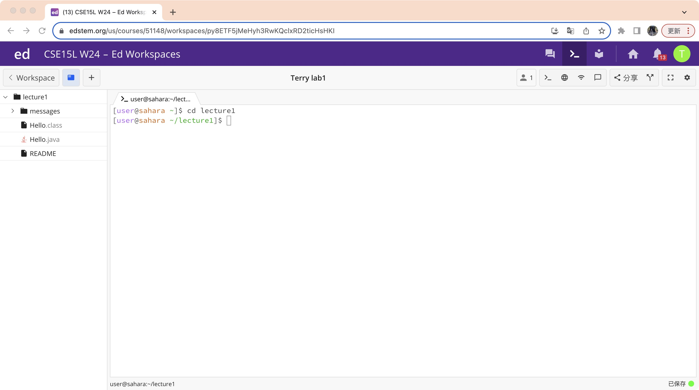

**Using cd without arguments**

When you using command cd without arguments, it defaults to changing the current working directory to home directory. 
*It is not an error*  

**Using cd with a path to a directory as an argument**

The output means that you have successfully using command cd to change directory to directory lecture1. 
*It is not an error* 
