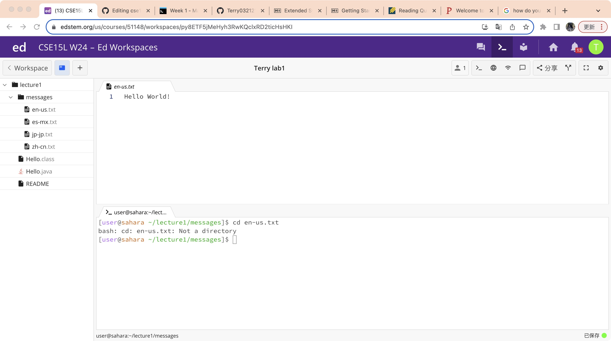
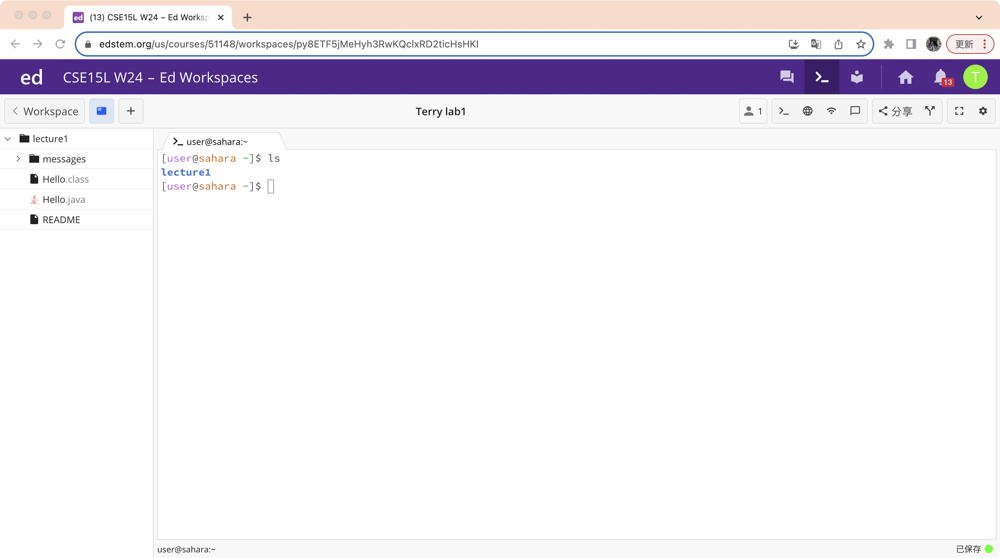
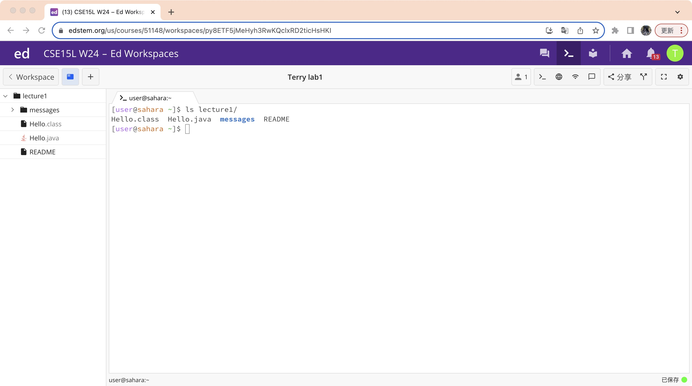
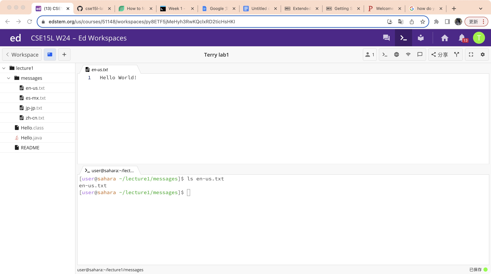
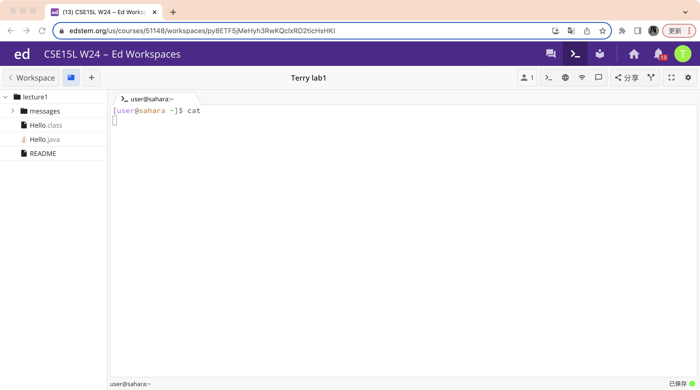

# CSE15l-lab1-report-Terry
## 1.Command cd
### **Using cd without arguments**

The working directory when the command was run is base directory. 
When you using command cd without arguments, it defaults to changing the current working directory to base directory. 
*It is not an error*  

### **Using cd with a path to a directory as an argument**

The working directory when the command was run is lecture1. 
The output means that you have successfully using command cd to change directory to directory lecture1. 
*It is not an error* 

### **Using cd with a path to a file as an argument**

The workign directoty when the command was run is /lecture1/message. 
The output means that we were trying to change directory to a file which we can not. The terminal was telling us that en-us.txt was a file. 
*It is an error*

## 2.Command ls
### Using ls without argumnets

The working directory when the command was run is base directory. 
The ouptut means that we used command ls to list all the contents of our base directory. 
*It is not an error*

### Using ls with a path to a directory as an argument

The working directory when the command was run is base directory. 
The output means that we used command ls to list all the contents of directory lecture1. 
*It is not an error*

### Using ls with a path to a file as an argument

The working directory when the command was run is /lecture1/message. 
When we using ls with a path to a file as an argument, the command is used to check wether the file is in the current directory. Because the file was actually in the directory, the terminal printed its name. 
*It is not an error*

## 3.Command cat
### Using cat without arguments

The working directory when the command was run is base directory. 
