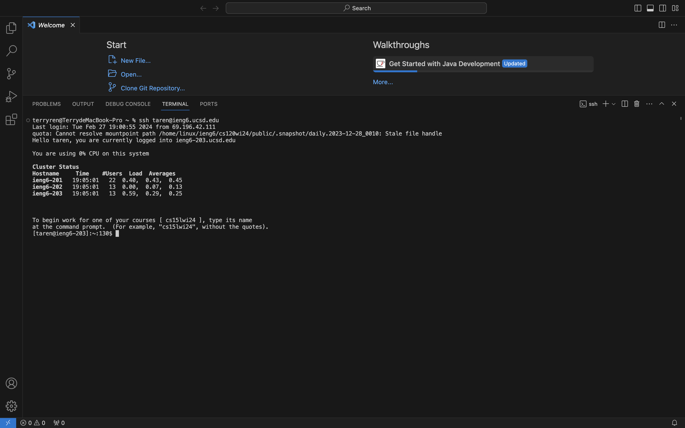
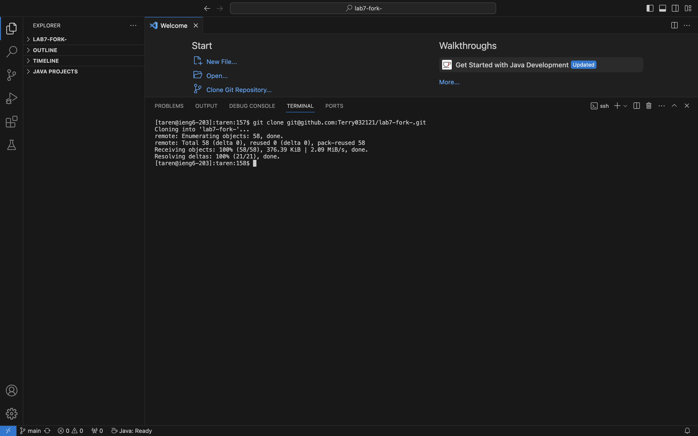
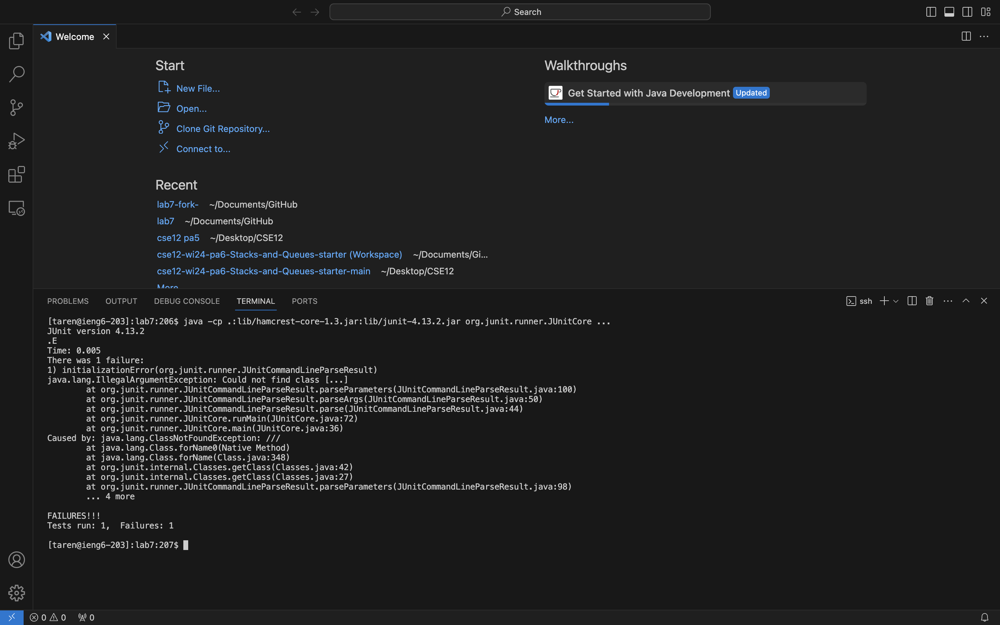
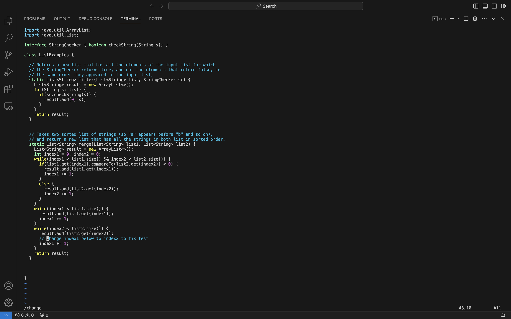
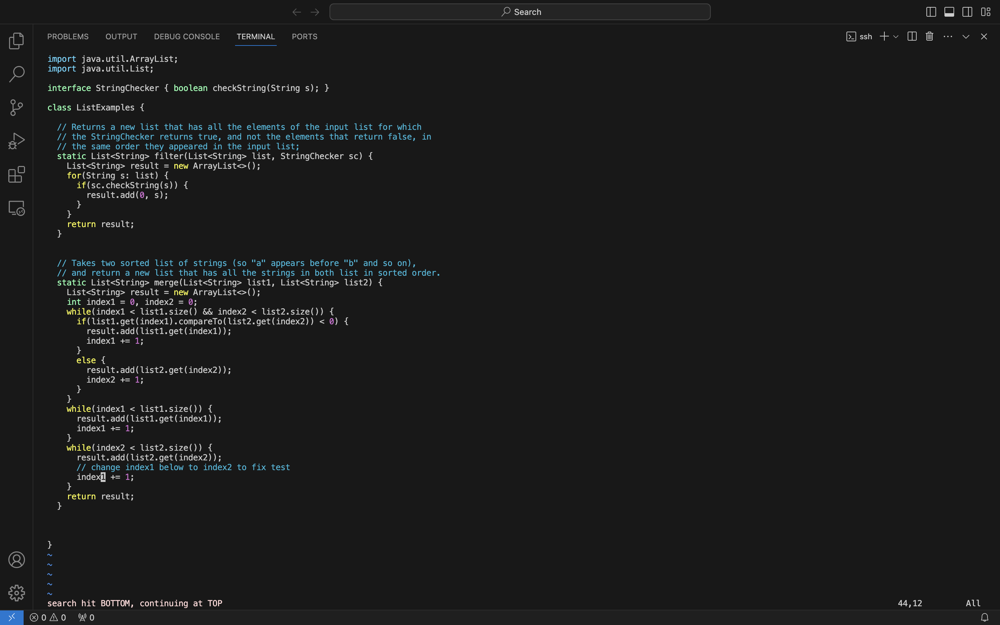
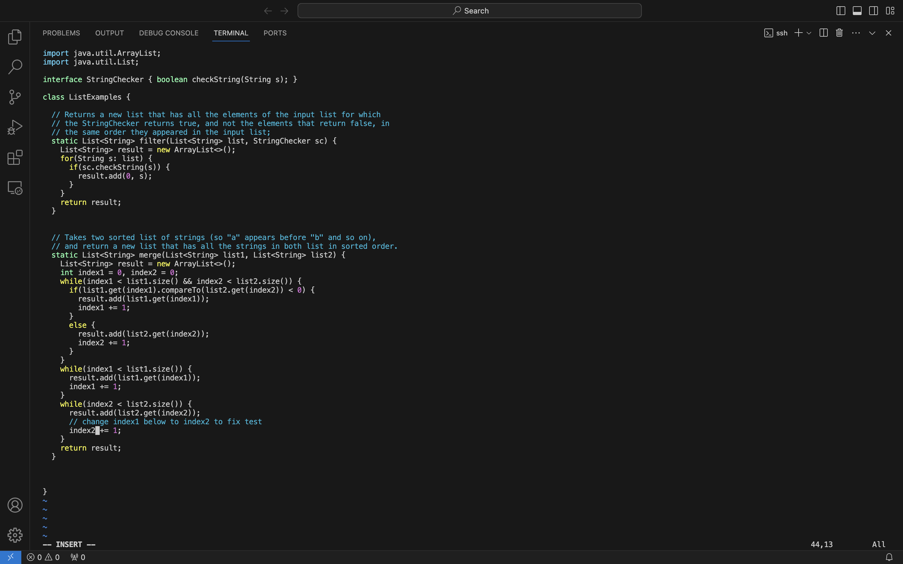
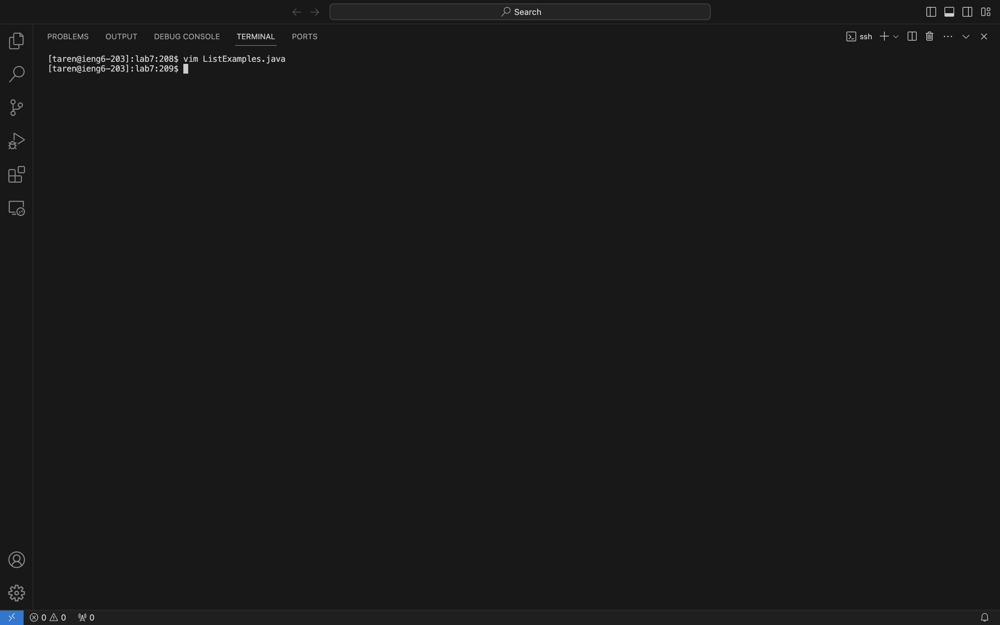
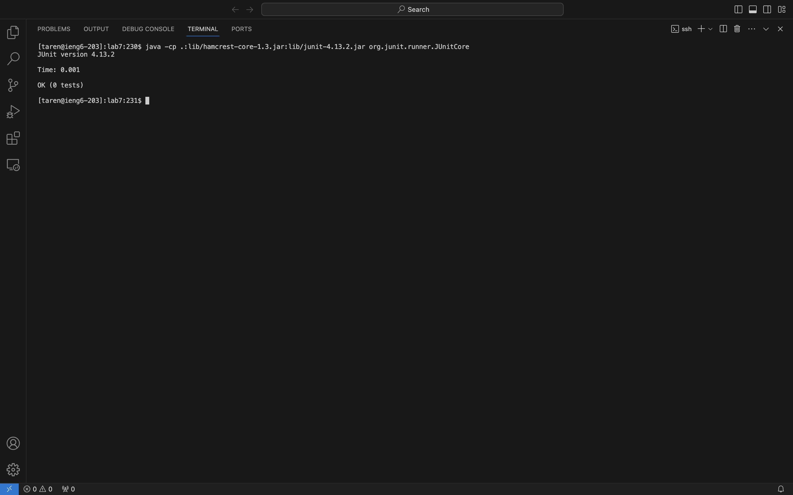
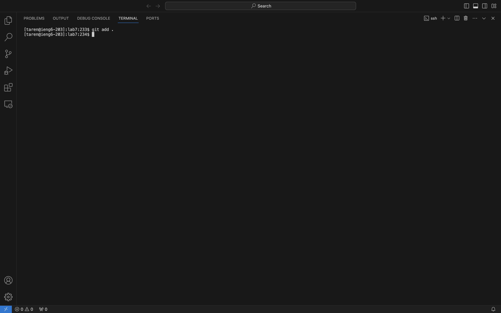

# CSE15l-labReport4-Terry.md
## Step4

Key pressed: `taren@ieng6.ucsd.edu <enter>`  
To log into my ieng6

## Step5

Key pressed: `git <space> clone <space> <Command+V> <enter>` 
To clone the repository 

## Step6

Key pressed: `<Command+V> <Enter>` 
Because I copy the command from the website so I can just paste it.

## Step7

Key pressed: `vim <space> Li <tab>.java` 
Open the `ListExample.java` in vim.

Key pressed: `/change`  
To locate word "change".

Key pressed: `j l l`  
To move the crusor to the place where we need to fix.

Key pressed: `i 2 l <backspace>`  
Start insert mode and insert 2, move to right and delete 1.

Key pressed: `<Control+C> :wq`  
Quit insert mode, quit and save.

## Step8

Key pressed: `<Command+V> <Enter>` 
I just paste it because I thought it was faster.

## Step 9

Key pressed: `add <space> git <space> .`  
Commit and push the resulting change to your Github account. 
