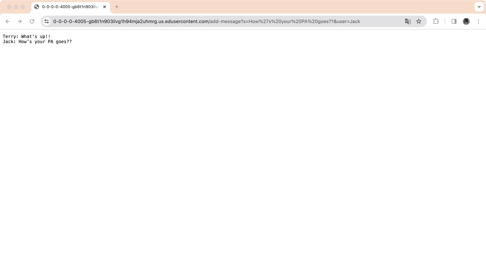
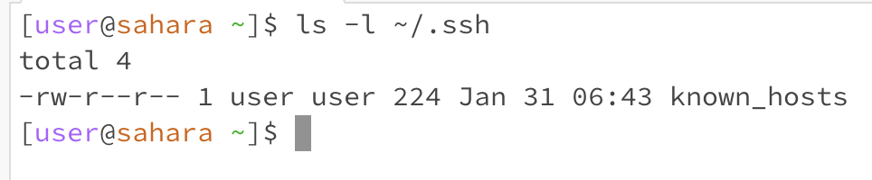
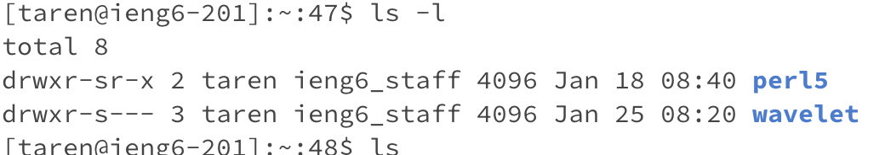
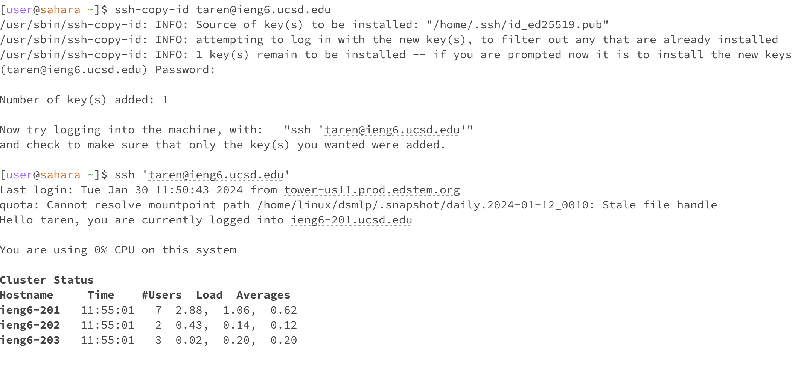

# CSE15l-lab2-report-Terry
## Part 1
### Code of ChatServer

```java
import java.io.IOException;
import java.net.URI;
import java.net.URLDecoder;
import java.io.UnsupportedEncodingException;

class Handler implements URLHandler {
    private static StringBuilder chat = new StringBuilder();

    public String handleRequest(URI url) {
        if (url.getPath().equals("/")) {
            return chat.toString();
        } else if (url.getPath().equals("/add-message")) {
            String query = url.getQuery();
            String[] params = query.split("&");
            String user = params[1].split("=")[1];
            String message = params[0].split("=")[1];

            try {
                user = URLDecoder.decode(user, "UTF-8");
                message = URLDecoder.decode(message, "UTF-8");
            } catch (UnsupportedEncodingException e) {
                e.printStackTrace();
            }

            chat.append(user).append(": ").append(message).append("\n");
            return chat.toString();
        } else {
            return "404 Not Found!";
        }
    }
}

class ChatServer {
    public static void main(String[] args) throws IOException {
        if(args.length == 0){
            System.out.println("Missing port number! Try any number between 1024 to 49151");
            return;
        }

        int port = Integer.parseInt(args[0]);

        Server.start(port, new Handler());
    }
}
```
### screenshots of using `/add-message`
#### Request 1: `add-message?s=What%27s%20up!!&user=Terry`

##### Methods Called:
`handleRequest(URI url)` in Handler class: <br>
This method is used when a request is received. <br>
##### Relevant Arguments and Field Values: <br>
`URI url`: Contains the URL of the request, which would be something like `https://0-0-0-0-4005-gb6t1n903ilvg1h94mja2uhmrg.us.edusercontent.com/add-message?s=What%27s%20up!!&user=Terry`. <br>
`chat`: A StringBuilder object, initially empty. <br>
##### Changes in Field Values:
The `chat` StringBuilder is appended with the string `"Terry: What's up!!!\n"`. <br>
After this request, chat.toString() would return `"Terry: What's up!!!\n"`. <br>
#### Request 2: `add-message?s=How%27s%20your%20PA%20goes??&user=Jack`


##### Methods Called:
`handleRequest(URI url)` in Handler class: <br>
Again, this method is triggered for the new request. <br>
##### Relevant Arguments and Field Values: <br>
`URI url`: Contains the URL of the request, which would be something like `https://0-0-0-0-4005-gb6t1n903ilvg1h94mja2uhmrg.us.edusercontent.com/add-message?s=How%27s%20your%20PA%20goes??&user=Jack`. <br>
`chat`: Contains `"Terry: What's up!!!\n"` from the previous request. <br>
##### Changes in Field Values: <br >
The `chat` StringBuilder is appended with the string "Jack: How's your PA goes\n".<br>
After this request, `chat.toString()` would return: "Jack: How's your PA goes\n" <br>

## Part2 
### The absolute path to the private key for your SSH key for logging into ieng6 

### The absolute path to the public key for your SSH key for logging into ieng6

### A terminal interaction where you log into your ieng6 account without being asked for a password

