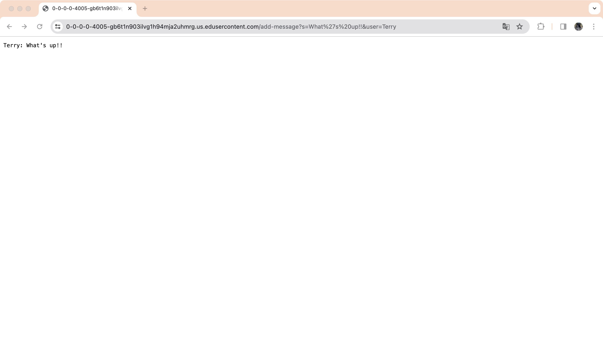

# CSE15l-lab2-report-Terry
## Part 1
### Code of ChatServer

```java
import java.io.IOException;
import java.net.URI;
import java.net.URLDecoder;
import java.io.UnsupportedEncodingException;

class Handler implements URLHandler {
    private static StringBuilder chat = new StringBuilder();

    public String handleRequest(URI url) {
        if (url.getPath().equals("/")) {
            return chat.toString();
        } else if (url.getPath().equals("/add-message")) {
            String query = url.getQuery();
            String[] params = query.split("&");
            String user = params[1].split("=")[1];
            String message = params[0].split("=")[1];

            try {
                user = URLDecoder.decode(user, "UTF-8");
                message = URLDecoder.decode(message, "UTF-8");
            } catch (UnsupportedEncodingException e) {
                e.printStackTrace();
            }

            chat.append(user).append(": ").append(message).append("\n");
            return chat.toString();
        } else {
            return "404 Not Found!";
        }
    }
}

class ChatServer {
    public static void main(String[] args) throws IOException {
        if(args.length == 0){
            System.out.println("Missing port number! Try any number between 1024 to 49151");
            return;
        }

        int port = Integer.parseInt(args[0]);

        Server.start(port, new Handler());
    }
}
```
### screenshots of using `/add-message`



